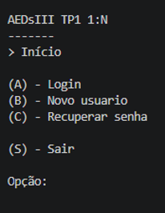
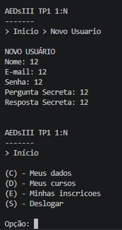
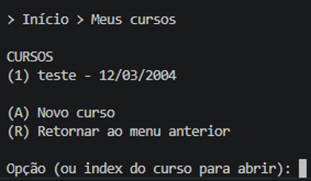
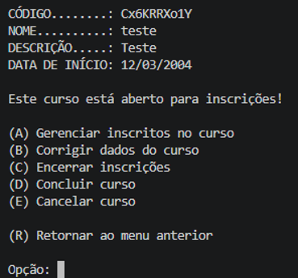
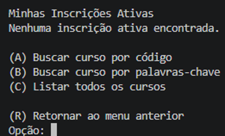
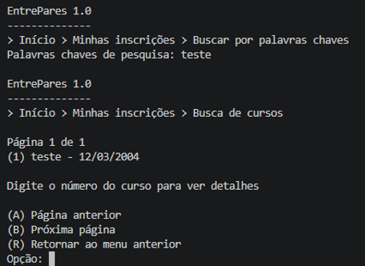
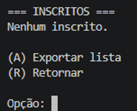

## TP3: ÍNDICE INVERTIDO

## Descrição Geral

Neste trabalho prático, evoluímos o sistema desenvolvido no TP2 para lidar com busca utilizando índice invertido

Nosso sistema é capaz de:

- Armazenar usuários e cursos em arquivos binários utilizando `RandomAccessFile`.
- Realizar operações completas de **CRUD** para todas as entidades.
- Implementar relacionamentos N:N entre Usuários e Cursos através de uma entidade **CursoUsuario** e duas **árvores B+**, permitindo a consulta eficiente de:
  - Quais usuários estão inscritos em determinado curso.
  - Em quais cursos um determinado usuário está inscrito.
- Garantir **consistência dos dados**, permitindo gerenciamento de inscrições, cancelamentos e estados de cursos.
- O índice invertido nos permite fazer buscas por entidades a partir de seus termos (palavras). Para isso, a gente precisa criar uma lista de IDs para cada termo indexado

A modelagem foi orientada a objetos e o projeto foi modularizado para facilitar testes, manutenção e evolução.

---

## Participantes

- Gabriel Couto
- Leonardo Amaral
- Rafael Cortat

---

## Estrutura de Classes

### Model:

#### 'ParIdId'

Índices para armazenar pares de dados na árvore B+.

#### 'CursoUsuario' 

Classe que representa o relacionamento entre um usuário e um curso. Contém:
- idCursoUsuario (chave primária)
- idCurso (chave estrangeira)
- idUsuario (chave estrangeira)
- Data da Inscrição

#### 'Usuario', 'Curso'

Classes modelo que representam uma entidade armazenada

### 'View'

Classes responsáveis pela interação com o usuário

#### 'MenuPrincipal'

Menu de navegação principal com acesso a:
- (1) Meus Cursos
- (2) Minhas Inscrições
- (3) Sair

#### 'MenuMinhasInscricoes'

- Métodos principais:
  - mostrarMinhasInscricoes() – Exibe os cursos em que o usuário está inscrito
  - buscarCursoPorCodigo() – Busca um curso específico pelo código
  - listarTodosCursos() – Lista todos os cursos com paginação (10 por página)
  - selecionarCurso() – Exibe os detalhes completos do curso
  - efetivarInscricao() – Realiza a inscrição do usuário no curso
  - cancelarInscricao() – Cancela a inscrição do usuário
 
#### 'MenuMeusCursos'

- Métodos principais:
  - listarMeusCursos() – Lista todos os cursos criados pelo usuário
  - selecionarCurso() – Exibe os detalhes do curso e opções de gerenciamento
  - gerenciarInscritos() – Exibe lista de inscritos no curso
  - exportarLista() – Exporta a lista de inscritos
  - corrigirDadosCurso() – Permite editar os dados do curso
  - encerrarInscricoes() – Encerra as inscrições do curso
  - concluirCurso() – Marca o curso como concluído
  - cancelarCurso() – Cancela o curso

#### 'MenuCursoUsuario'

- Métodos principais:
  - incluirInscricao() – Cria a associação entre usuário e curso
  - cancelarInscricao() – Remove a associação entre usuário e curso
  - listarInscricoesCurso() – Lista todas as inscrições de um curso
  - listarInscricoesUsuario() – Lista todas as inscrições de um usuário

### 'Arquivos'

#### 'ArqCursoUsuario'

Classe que gerencia o CRUD das inscrições (CursoUsuario), mantendo dois índices B+:

- Métodos principais:
  - 'readCurso(int idCurso)' – retorna todas as inscrições de um curso
  - 'readUsuario(int idUsuario)' – retorna todas as inscrições de um usuário
  - 'readPor(int idCurso, int idUsuario)' – retorna a inscrição específica
  - 'create(CursoUsuario cu)' – cria uma nova inscrição

#### 'ArqCurso'

Classe que gerencia o índice de cursos e o armazenamento dos cursos

Métodos principais:
  - 'readCodigo(String codigo)' - recebe um código e retorna o curso
  - 'readNome(String nome)' - recebe um nome e retorna cursos por meio da árvore B+
  - 'create(Curso c)' - cria um curso, atualiza o índice e salva na árvore B+

#### 'ArqUsuario'

Classe que gerencia os índices de usuário e o armazenamento dos usuários.

Métodos principais:
  - 'readNome(String nome)' - recebe um nome e retorna um array com os usuários por meio da árvore B+
  - 'create(Usuario u)' - cria um usuário, atualiza o índice e salva na árvore B+

## Relacionamento N:N

Uma inscrição em um curso será uma associação de um usuário a um curso através de uma entidade **CursoUsuario**. 

### Tipos de Relacionamentos

1. **1:N** - Uma entidade de um tipo se relaciona com várias entidades de outro tipo. Exemplo: uma categoria possui vários produtos (já implementado no TP1).

2. **N:N** - As entidades de um tipo se relacionam com várias entidades de outro tipo. Exemplos:
   - Um usuário se inscreve em vários cursos
   - Um curso tem vários usuários inscritos
   - Um autor escreve vários livros; um livro tem vários autores
   - Uma playlist contém várias músicas; uma música está em várias playlists

Utilizamos duas **árvores B+** como índices:

1. **Índice por Curso**: (idCurso; idCursoUsuario)
   - Permite recuperar todas as inscrições de um curso
   - Usado para listar inscritos e gerenciar participantes

2. **Índice por Usuário**: (idUsuario; idCursoUsuario)
   - Permite recuperar todas as inscrições de um usuário
   - Usado para listar os cursos em que o usuário está inscrito

A razão pela qual criamos duas estruturas é que as estruturas de dados (como árvores B+) geralmente permitem busca eficiente por uma única chave de ordenação. Uma única árvore B+ não pode ter dois critérios de ordenação simultaneamente.

----------------------------------------------------------------------------------------

**Descrição Completa do Sistema**

O sistema é uma aplicação Java de linha de comando para gerenciamento de cursos, usuários e inscrições. Ele implementa uma plataforma de cadastro e consulta de cursos na qual cada usuário registrado pode criar cursos, acompanhar seus próprios cursos, inscrever-se em cursos disponíveis, cancelar inscrições e gerenciar seus dados pessoais.
Fluxo Geral do Sistema
Tela Inicial
Ao iniciar o sistema, o usuário encontra as seguintes opções:
•	(A) Login 
•	(B) Novo usuário 
•	(C) Recuperar senha 
•	(S) Sair 
Esse fluxo é controlado pela classe Principal.

Tela Após Login
Após realizar o login com sucesso, o usuário tem acesso ao menu principal:
•	(C) Meus dados 
•	(D) Meus cursos 
•	(E) Minhas inscrições 
•	(S) Deslogar 
Funcionalidades do Sistema

Meus Dados
Nesta área são exibidos o nome e o e-mail do usuário autenticado.
O usuário pode:
•	Alterar seus dados pessoais; 
•	Excluir sua conta. 
A exclusão da conta só é permitida caso o usuário não possua cursos ativos nem inscrições ativas. Essa regra garante a consistência dos relacionamentos entre usuários, cursos e inscrições.
Essa lógica é implementada na classe ControleUsuario.

Meus Cursos
Esta funcionalidade apresenta todos os cursos criados pelo usuário.
As operações disponíveis são:
•	Criar novo curso; 
•	Visualizar detalhes de um curso existente. 
Ao acessar os detalhes de um curso, o usuário pode:
•	Editar curso; 
•	Encerrar inscrições; 
•	Marcar curso como concluído; 
•	Cancelar curso; 
•	Listar inscritos; 
•	Exportar lista de inscritos para o arquivo inscritos.csv. 
O gerenciamento dos cursos é realizado pela classe CursoController, enquanto a interação com o usuário é feita pela classe VisaoCurso.

Minhas Inscrições
Esta funcionalidade apresenta todas as inscrições ativas do usuário.
As operações disponíveis são:
•	Buscar curso por código; 
•	Buscar curso por palavras-chave; 
•	Listar todos os cursos; 
•	Selecionar uma inscrição para visualizar seus detalhes; 
•	Cancelar inscrição. 
Esse menu é implementado pela classe InscricoesController utilizando a classe VisaoInscricoes.

----------------------------------------------------------------------------------------

Principais Funcionalidades Implementadas
•	Cadastro de usuários; 
•	Login de usuários; 
•	Recuperação de senha por meio de pergunta secreta; 
•	Criação, consulta, atualização e remoção de cursos (CRUD); 
•	Controle dos estados do curso; 
•	Inscrição e cancelamento de inscrições; 
•	Busca de cursos por código; 
•	Busca avançada por palavras-chave; 
•	Paginação de resultados; 
•	Exportação da lista de inscritos para arquivo CSV; 
•	Exclusão de conta com remoção em cascata dos relacionamentos associados. 

----------------------------------------------------------------------------------------

Figura 1 – Tela Inicial

Figura 2 – Menu Principal

Figura 3 – Meus Cursos

Figura 4 – Detalhes de Curso

Figura 5 – Minhas Inscrições

Figura 6 – Buscar curso por palavras-chave

Figura 7 – Gerenciar inscritos no curso

Classes Desenvolvidas
Controle e Interface
•	Principal 
•	ControleUsuario 
•	CursoController 
•	InscricoesController 
•	VisaoUsuario 
•	LoginInfo 
•	VisaoCurso 
•	VisaoInscricoes 

CRUD de Cursos
•	ArquivoCurso 
•	Curso 
•	GeradorCodigo 
•	ListaInvertidoHelper 
•	ParCodigoID 
•	ParIdUsuarioIdCurso 

CRUD de Usuários
•	ArquivoUsuario 
•	Usuario 
•	ParEmailID 

CRUD de Relacionamentos Curso-Usuário
•	ArquivoRelacionamentoCursoUsuario 
•	RelacionamentoCursoUsuario 
•	ParIdCurso_IdUsuario 
•	ParIdUsuario_IdCurso 

Estruturas de Dados Persistentes
•	Arquivo (genérico da biblioteca AED3) 
•	HashExtensivel 
•	ListaInvertida 
•	ParIDEndereco 
•	Registro 
•	RegistroHashExtensivel 
•	ArvoreBMais 
•	RegistroArvoreBMais 
•	ParIntInt 

Classes de Apoio
•	InscritoTempData 
Essa classe é utilizada para armazenar temporariamente dados de inscritos para exibição e exportação.

**Operações Especiais Implementadas**
1. Índices para Acesso Rápido
A classe ArquivoCurso mantém os seguintes índices:
•	HashExtensivel<ParCodigoID>, utilizado para localizar cursos rapidamente pelo código; 
•	ArvoreBMais<ParIdUsuarioIdCurso>, utilizada para listar todos os cursos criados por um usuário. 
Esses índices permitem consultas mais eficientes do que a simples leitura sequencial dos registros.
2. Índice Invertido e Busca por Palavras-Chave
O sistema utiliza as classes:
•	ListaInvertida; 
•	ListaInvertidoHelper. 
Sempre que um curso é criado ou atualizado, o nome do curso é processado por tokenização e normalização, sendo posteriormente armazenado no índice invertido.
Durante as pesquisas:
•	Stop words são removidas; 
•	O cálculo de relevância é realizado utilizando TF-IDF; 
•	Os cursos são classificados conforme sua relevância para a consulta realizada. 
Essa funcionalidade está implementada no método ArquivoCurso.pesquisa(String query).
3. Paginação de Resultados
O método ArquivoCurso.resultadosPesquisaPaginados(...) retorna os resultados de busca organizados em páginas.
No menu de inscrições, o usuário pode navegar entre as páginas utilizando as opções:
•	(A) Página anterior; 
•	(B) Próxima página; 
•	(R) Retornar. 
4. Exportação de Inscritos para CSV
Nos detalhes de um curso, o usuário pode exportar a lista de inscritos para o arquivo inscritos.csv.
A exportação é realizada utilizando a classe PrintWriter dentro do CursoController.
5. Exclusão Condicionada de Conta
A funcionalidade de exclusão de conta verifica previamente se o usuário possui cursos ativos.
Caso a exclusão seja permitida, o sistema remove:
•	As inscrições realizadas pelo usuário; 
•	As inscrições dos cursos criados pelo usuário; 
•	Os cursos criados pelo usuário; 
•	O cadastro do usuário. 
Esse procedimento garante a integridade dos dados armazenados.
6. Cancelamento de Inscrição
O cancelamento de inscrição é realizado por meio do menu de detalhes da inscrição.
A operação remove o relacionamento correspondente armazenado na entidade RelacionamentoCursoUsuario.
7. Controle de Estados dos Cursos
Os cursos podem assumir os seguintes estados:
•	Aberto; 
•	Encerrado; 
•	Concluído; 
•	Cancelado. 
As alterações de estado são realizadas pelo CursoController e persistidas utilizando o método ArquivoCurso.update(...).
8. Fallback de Busca por Código
A busca de cursos por código utiliza inicialmente o índice hash.
Caso ocorra alguma inconsistência no índice, o sistema realiza uma busca linear como mecanismo de fallback.
Essa abordagem garante que a consulta continue funcionando mesmo em situações excepcionais.

**Telas e Menus Principais**
Tela 1 – Início
AEDs III TP1 – Relacionamento 1:N
•	Login
•	Novo usuário
•	Recuperar senha
•	Sair
Tela 2 – Menu Principal do Usuário
•	Meus dados 
•	Meus cursos 
•	Minhas inscrições 
•	Deslogar 
Tela 3 – Meus Cursos
•	Listagem dos cursos do usuário; 
•	Criação de novo curso; 
•	Seleção de um curso para visualizar seus detalhes. 
Tela 4 – Detalhes do Curso
Exibe todas as informações do curso e disponibiliza as opções:
•	Ver inscritos; 
•	Exportar inscritos; 
•	Editar curso; 
•	Encerrar inscrições; 
•	Concluir curso; 
•	Cancelar curso. 
Tela 5 – Minhas Inscrições
Exibe as inscrições ativas do usuário e permite:
•	Buscar curso por código; 
•	Buscar curso por palavras-chave; 
•	Listar todos os cursos; 
•	Visualizar detalhes de uma inscrição; 
•	Cancelar inscrição.

## CHECKLIST?

- [x] O índice invertido com os termos dos nomes dos cursos foi criado usando a classe ListaInvertida? *SIM*
- [x] É possível buscar cursos por palavras no menu de inscrição? *SIM*
- [x] O trabalho compila corretamente? *SIM*
- [x] O trabalho está completo e funcionando sem erros de execução? *SIM*
- [x] O trabalho é original e não a cópia de um trabalho de outro grupo? *SIM*
---
